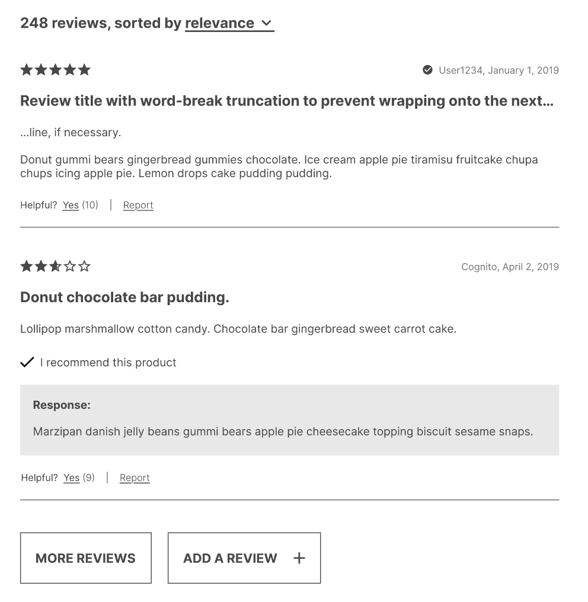

# SPHINX


Working from a detailed business requirement document and an accompanying wireframe we were tasked with creating a functioning product page for an e-commerce site. This project was created in a week with a 4 person development team. Each team member took on one of the four widgets that make up the webpage. The project uses Node.js, Express.js and React.

My main contributions to the project where:

- Building the 'Ratings & Reviews' section
- Setting up our testing frame work (Jest, Enzyme, Puppeteer)
- Implementing React Router to allow for unique URLs for each product

# Table Of Contents

- [Technology Used](#technology-used)

- [Requirements](#requirements)

- [Installation](#installation)

- [Ratings & Reviews](#ratings-&-reviews)

  - [Ratings Breakdown](#ratings-breakdown)

  - [Reviews List Breakdown](#reviews-list-breakdown)

  - [Add A Review Form Breakdown](#add-a-review-form-breakdown)
***
## Technology Used

<div style="text-align: center">
  
</div>

### Front End

- React
- React Router
- SCSS
- Webpack
- Babel

### Back End

- Node.js
- Express

### Testing / Development

- NPM
- ESLint
- Jest
- Enzyme
- Puppeteer

## Requirements

- Node.js v14.0.0 or later
- Active github account

## Installation

1. Fork the repo and clone it down to your computer.
   ​
2. Open it in VS Code (or whatever IDE you use) like you normally would.
   ​
3. To be able to make HTTP requests to the API in this repo, you must create and use a GitHub API Token. Here is how to obtain your Token:

- Go to: https://github.com/settings/tokens
- Click "Generate New Token"
- Given the Token a Description (e.g. "My token")
- Under Select Scopes, select the following:
  - read:org
  - user
  - read:user
  - user:email
  - user:follow
- Generate Token
  - Note that this token is only viewable once, at generation time. Make sure to copy it to a secure place.
    ​

4. In the "server" directory of the repository, make a copy of the "config_example.js" file and rename it to "config.js."
   ​
5. In config.js, replace "\<Auth Token\>" with your GitHub API Token (from step 3, above) as a string and make sure all changes up to this point are saved.
   ​
6. In your terminal, from the root directory of the repository, run
   ```
   npm install
   ```
7. Next build the app bundle by running the command

   ```
   npm build
   ```

8. Once the app bundle is done building run this to start your server
   ` npm start `
   ​
9. In your browser go to: http://localhost:3000 where the application should load up.  
   ​
10. Feel free to click around the application and explore the interactivity of the various components.

# Ratings & Reviews

This component was build to the specifications given in the business requirement document and the accompanying wireframe. All components were build from scratch in React and styles using SCSS.


## Ratings Breakdown

---

### Requirements

Display the products meta data, including:

- Average star rating
- The percent of customers that recommend the product
- Visual breakdown of how many reviews there are for each star rating
- The breakdown by star rating should be able to filter the reviews list
- Visual breakdown of how users rate the product on relevant characteristics.

| Wireframe                                                             | Actual                                                          |
| --------------------------------------------------------------------- | --------------------------------------------------------------- |
|  |  |

## Reviews List Breakdown

---

### Requirements

- Display a list of review cards
- Should display two cards by default
- Should have a button to show more reviews
- Should have a dropdown menu for sorting the reviews
- Should be filterable by the star rating
- Should have a way for users to mark reviews helpful or report the reviews
- Display user uploaded images

| Wireframe                                                           | Actual                                                        |
| ------------------------------------------------------------------- | ------------------------------------------------------------- |
|  |  |

## Add A Review Form Breakdown

---

### Requirements

- Input fields of various types depending on question
- Dynamically generated fields based on product characteristics
- Form validation and user feedback for invalid fields
- Should be a modal

| Modal Form                                              |
| ------------------------------------------------------- |
|  |

| Form Validation                                                               |
| ----------------------------------------------------------------------------- |
|  |
